# DnCNN

This repository contains the codes for the implementation of the paper - [Beyond a Gaussian Denoiser: Residual Learning of Deep CNN for Image Denoising]. This was done as part of a course project.

[Beyond a Gaussian Denoiser: Residual Learning of Deep CNN for Image Denoising]: https://ieeexplore.ieee.org/document/7839189

## Introduction

During the past decade, convolutional neural networks have shown great success in handling various low-level vision tasks. Image denoising is one such long-standing problem in computer vision. The goal of image denoising is to recover the clean image *x* from the noisy image *y = x + v*. The assumption is that *v* is Additive White Gaussian Noise (AWGN). In general, image denoising methods can be grouped into two major categories - model based methods, and discriminative learning based. Model based methods like BM3D and WNNM are flexible in handling denoising problem with various noise levels, but their execution is time consuming, and they require the modelling of complicated priors. To overcome these drawbacks, discriminative methods have been developed.

The paper we implement is - Beyond a Gaussian Denoiser: Residual Learning of Deep CNN for Image Denoising, by Kai Zhang et al. We refer to this as the base paper. The proposed denoising convolutional neural network is named DnCNN. Rather than directly outputing the clean image *x'*, the model is trained to predict the residual image *x'*, that is the difference between the noisy observation and the latent clean image. The batch normalization technique further improves and stabilizes the training performance of the DnCNN.

When *v* is the difference between the ground truth high resolution image and the bicubic upsmapled version of the low resolution image, the image degradation model can be converted to a single image super-resolution problem. Similarly, when *v* represents the difference between the original image and the compressed image, the JPEG image deblocking problem can be modeled by the same image degradation model. JPEG Deblocking refers to the removal of compression artifact that accompanies the application of lossy compression. In this sense, the SISR and JPEG deblocking can be considered as two special cases of a 'general' image denoising problem. We extend the DnCNN to handle these general image denoising tasks together, i.e. a single model is able to handle blind gaussian denoising, SISR, and JPEG Deblocking.

The following tasks were completed - 

1. We successfully implement all the models from the base paper - namely DnCNN for handling a known level of gaussian noise, (named DnCNN-S), DnCNN for blind gaussian denoising (named DncNN-B), and DnCNN to handle three general image denoising tasks, namely Blind Gaussian Denoising, SISR, and JPEG Deblocking (named DnCNN-3). 
2. In addition to implementation of the base paper, we conduct additional experiments on the denoising model. The base paper employs L2-loss as the loss function to train the network, also known as the mean squared error (MSE). Motivated by the fact that MSE is not an adequate metric to judge human visual perception, we employ the use of Structural SIMilarity (SSIM) index as a loss function. To make a well-rounded observation, we also train the network with L1-loss, and with 'L1-loss + SSIM' as a combined loss function. We show that L2-loss is not the best choice to train the network.
3. Taking inspiration from the base paper where they use the residual learning strategy to solve SISR and JPEG Deblocking problem with the same network, we extend the DnCNN model to another image restoration task - Image Deblurring. In this case, the residue *v* would be the difference between the clean image, and the image that has been degraded by a blurring operator. 

The preprocessing of the dataset was done in MATLAB, and the training and testing codes were written in Keras. The codes are for CDnCNN-3, which is the model that handles the three general image denoising tasks corresponding to coloured images.

The detailed report is here [Report].

[Report]: https://github.com/ocimakamboj/DnCNN/blob/master/Report.pdf

### Terminology

DnCNN-S - network trained for specific noise level and grayscale images.
DnCNN-B - network trained for blind gaussian noise and grayscale images.
CDnCNN-B - network trained for blind gaussian noise and coloured images.
SSIMDnCNN-S and SSIMDnCNN-B - networks trained using (1-SSIM) as the loss function.
L1DnCNN-S - network trained with L1-loss
MixDnCNN-B - network trained with &alpha; L1 + (1-&alpha;)(1-SSIM) loss. Value of &alpha; was set to 0.8.
DnCNN-3 - network trained to gaussian denoising, superresolution and JPEG Deblocking, for grayscale images
CDnCNN-3 - same as DnCNN-3, but for coloured images.
CDnCNN-Deblur - network trained for deblurring task.

## Visual Results - Image Denoising

Denoising results with noise level 50.

    

 
  (left) Noisy / 15.34dB, (middle) BM3D / 24.61dB, (right) DnCNN-S / 25.9dB

  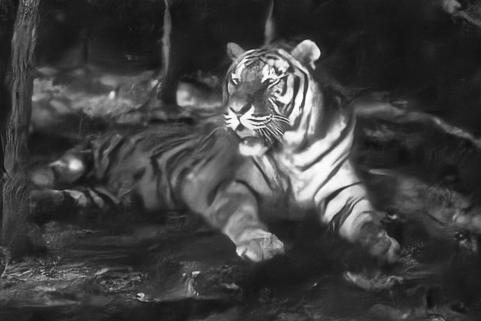  

 
  (left) DnCNN-B / 25.84dB, (middle) L1DnCNN-B / 25.85dB, (right) Ground Truth

   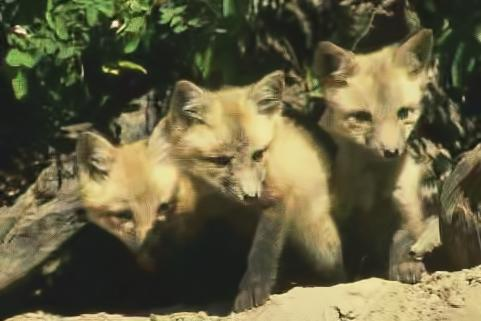 

 
  (left) Noisy / 17.92dB, (right) BM3D / 24.06dB

  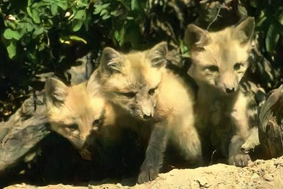  

 
  (left) CDnCNN-B / 27.05dB, (right) Ground Truth

## Visual Results - Super-resolution and JPEG Deblocking

Single image super-resolution of ’monarch’ from Set5 dataset with scale factor of 4.

  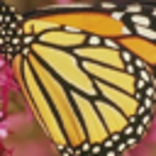 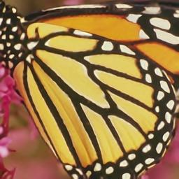 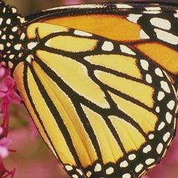

 
  (left) Bicubic Upsampled Version, (middle) CDnCNN-3, (right) Ground Truth

Single image super-resolution of one from Urban100 dataset with scale factor of 4.

    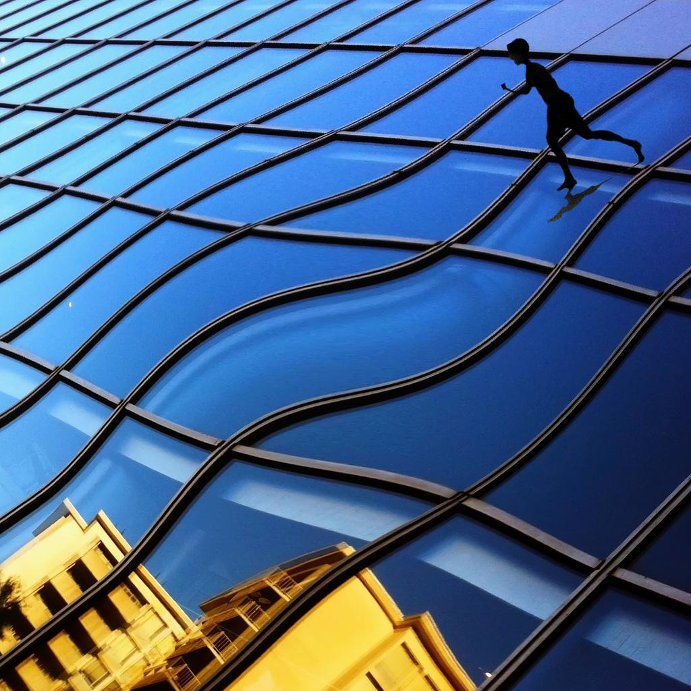

 
  (left) Bicubic Upsampled Version, (middle) CDnCNN-3, (right) Ground Truth

 JPEG image deblocking results of ”Carnivaldolls” from LIVE1 dataset with quality factor 10.

  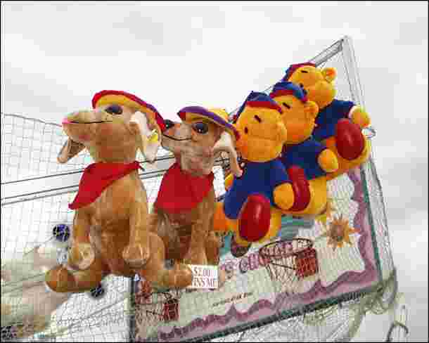 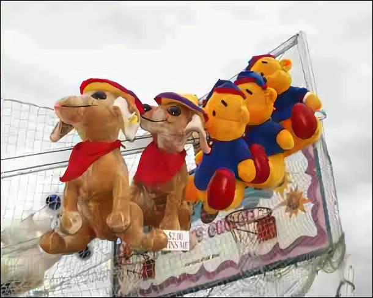 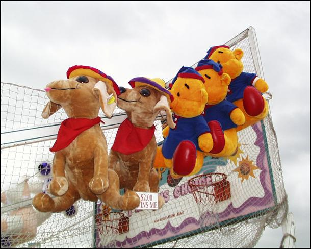

 
  (left) Compressed Image, (middle) CDnCNN-3, (right) Ground Truth

JPEG image deblocking results of ”Parrots” from LIVE1 dataset with quality factor 10.

    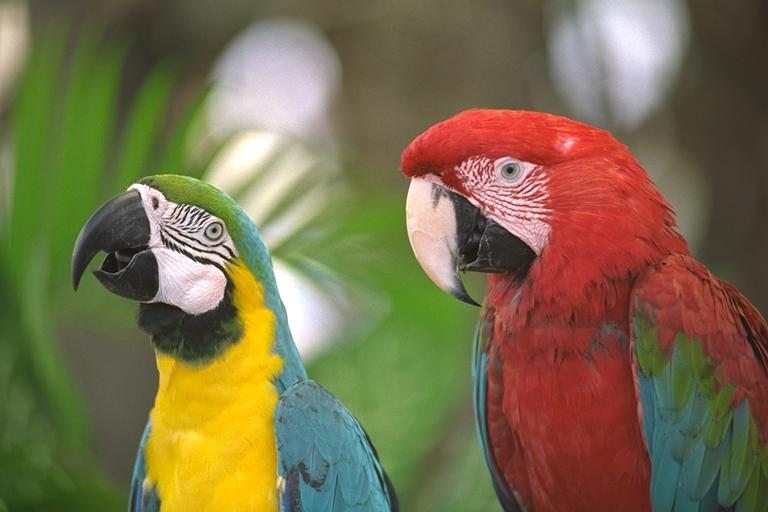

 
  (left) Compressed Image, (middle) CDnCNN-3, (right) Ground Truth

An example to show the capacity of CDnCNN-3 for three different tasks. The input image is composed of following noisy images - noise level 15 (upper left) and 25 (lower left), bicubically interpolated low resolution images with scaling factor 2 (upper middle) and 3 (lower middle), JPEG images with quality factor 10 (upper right) and 30 (lower right). The white lines in the input image are just to distinguish the different regions, and the residual image has been normalized in the range of [0,1] for visualization. Even with different types of corruptions, the restored image looks natural without any artifact.

  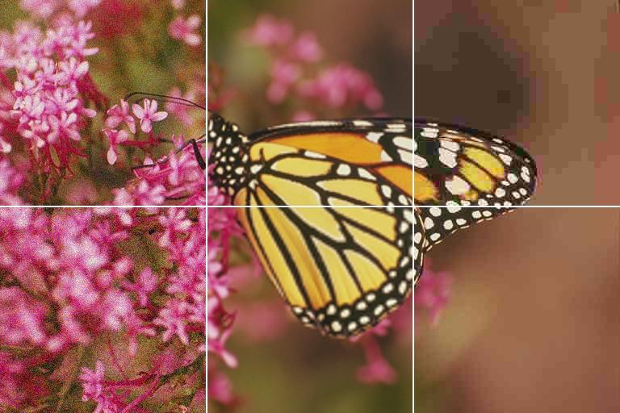 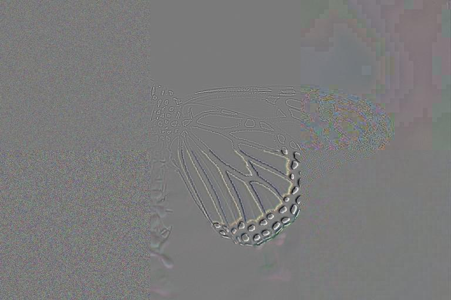 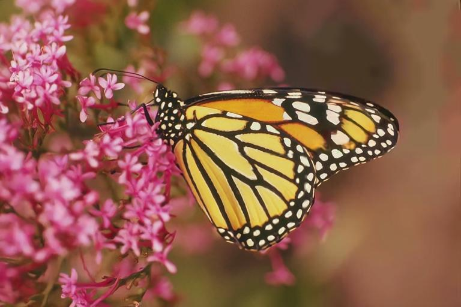

 
  (left) Input Image, (middle) Output Residual Image, (right) CDnCNN-3

  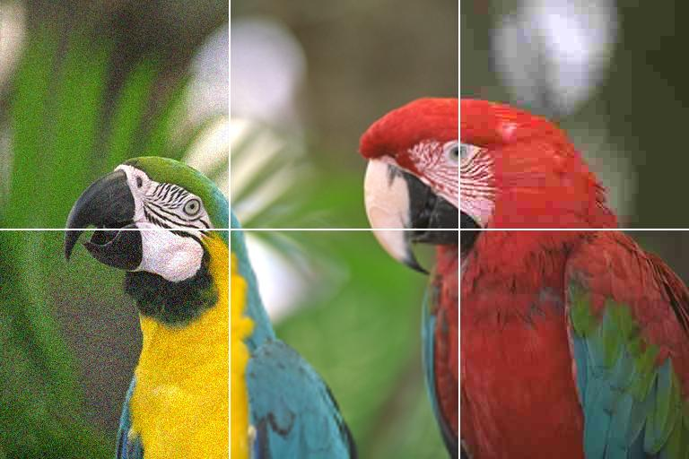 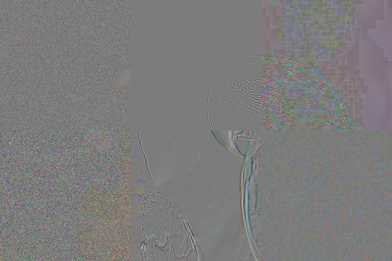 

 
  (left) Input Image, (middle) Output Residual Image, (right) CDnCNN-3

## Visual Results - Image Deblurring

  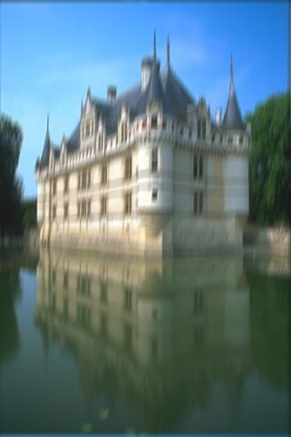  

 
  (left) Blurred Image, (middle) CDnCNN-Deblur, (right) Ground Truth

  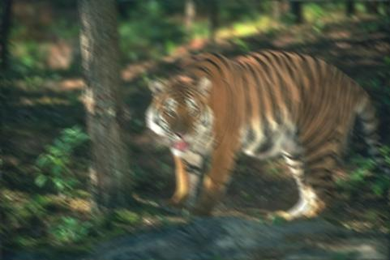  

 
  (left) Blurred Image, (middle) CDnCNN-Deblur, (right) Ground Truth

